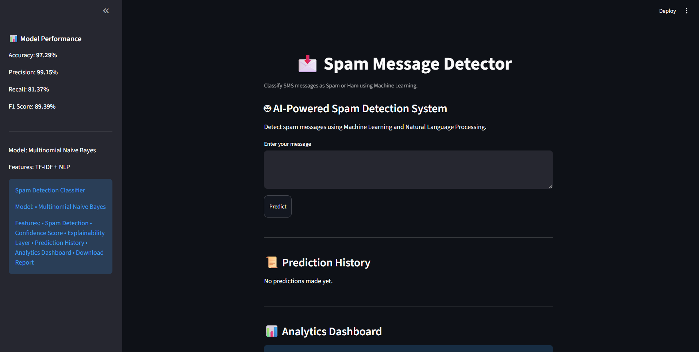
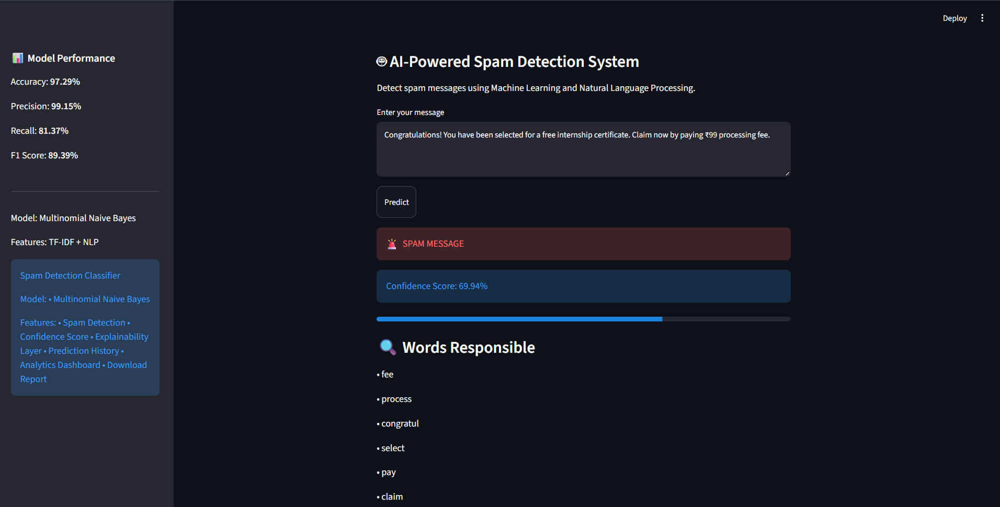
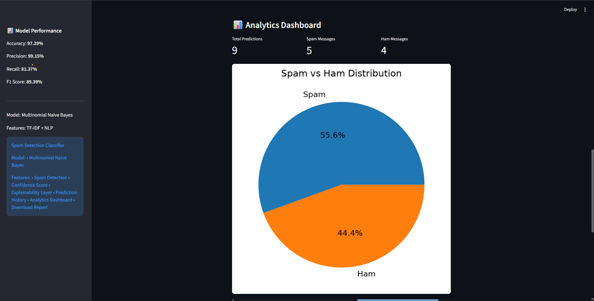

# Spam Message Detection Classifier


## Project Overview

This project is a Machine Learning based Spam Message Detection System built using Natural Language Processing (NLP) techniques.

The model classifies SMS messages as either:

- Spam
- Ham (Not Spam)

The project uses TF-IDF Vectorization and Multinomial Naive Bayes for text classification and provides a user-friendly Streamlit web application for real-time predictions.

---

## Features

- Text preprocessing using NLP
- Tokenization
- Stopword removal
- Punctuation removal
- Stemming
- TF-IDF Vectorization
- Multinomial Naive Bayes Classifier
- Real-time Spam Prediction
- Streamlit Web Application

---

## Dataset

Dataset used:

SMS Spam Collection Dataset

Total Messages: 5572

Classes:
- Ham
- Spam

---

## Model Performance

| Metric | Score |
|----------|----------|
| Accuracy | 97.29% |
| Precision | 99.16% |
| Recall | 81.38% |
| F1 Score | 89.39% |

---

## Tech Stack

- Python
- Pandas
- NumPy
- NLTK
- Scikit-learn
- Streamlit
- Joblib

---

## Project Structure

```text
Spam_classifier_detection
│
├── data
│   └── spam.csv
│
├── models
│   ├── model.pkl
│   └── vectorizer.pkl
│
├── notebooks
│
├── app
│   └── app.py
│
├── requirements.txt
└── README.md
```

## How to Run

Clone the repository:

```bash
git clone <repository-url>
```

Install dependencies:

```bash
pip install -r requirements.txt
```

Run the application:

```bash
cd app
streamlit run app.py
```

---

## Sample Predictions

Spam Example:

```
Congratulations! You have won a free iPhone. Click here now!
```

Output:

```
SPAM
```

Ham Example:

```
Hey Khushi, are you free for class tomorrow?
```

Output:

```
HAM
```

---
## Screenshots

### Home Page



### Prediction Result



### Analytics Dashboard



## Future Improvements

- Deep Learning based Spam Detection
- Transformer Models (BERT)
- Email Spam Classification
- Multi-language Support
- Cloud Deployment
- User Authentication
- Real-time Analytics

## Author

Khushi Karanjiya